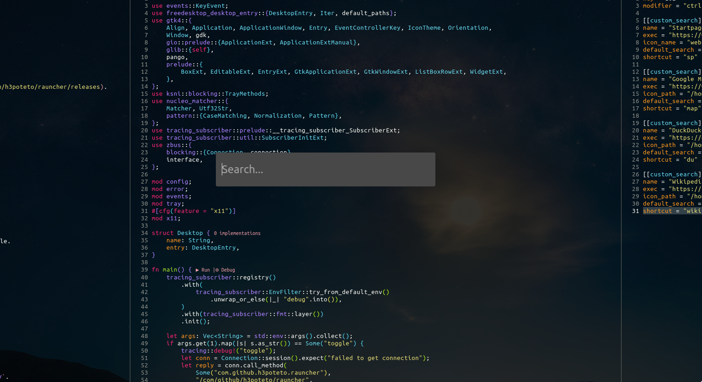
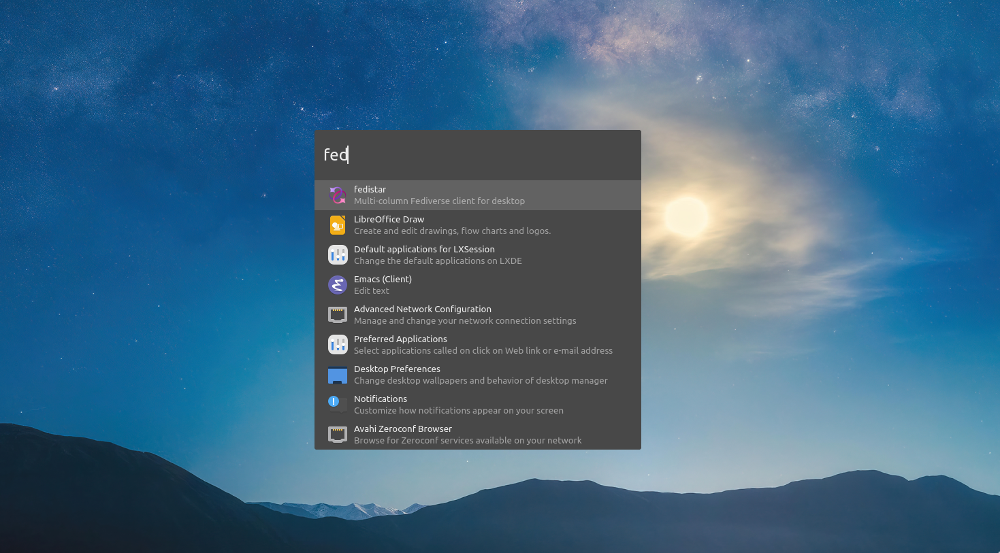

# Rauncher
Rauncher is an application launcher for Linux desktop. It supports both X11 and Wayland.





## Install
### AUR

```terminal
$ yay -S rauncher-wayland # or rauncher-x11
```

### Pre-built packages
`deb` packages are included with each release, please refer [release page](https://github.com/h3poteto/rauncher/releases).

### Manual
Please install required packages:

- snixembed (X11)
- gtk4-layer-shell (Wayland)


```terminal
$ git clone https://github.com/h3poteto/rauncher.git
$ cd rauncher
$ make build-wayland # or build-x11
$ sudo make install
```

## Usage
### X11
The configuration file will be created after you launch `rauncher`. So, please update the file.

```toml
[hotkey]
key = 102         # You can check the keycode with xev.
modifier = "ctrl" # "ctrl", "shift", or "alt"

[[custom_search]]
name = "Google"
exec = "https://www.google.com/search?q=%q"
icon_name = "web-browser"
default_search = true
shortcut = "g"
```

The default hotkey is <kbd>Ctrk</kbd>+<kbd>Space</kbd>. You can check the keycode using `xev`.

### Wayland
In wayland, `rauncher` can't catch global shortcut keys, so `hotkey` section in the configuration file is ignored. Instead, `rauncher` provides subcommand.
```
$ rauncher toggle
```

So, plsase set a shortcut key in your compositor settings, e.g. sway

```
exec sleep 2 && rauncher

bindsym Control+space exec rauncher toggle
```

## Configuration
You can define your own custom search commands. For example,

```toml
[[custom_search]]
name = "Startpage"
exec = "https://www.startpage.com/sp/search?q=%q"
icon_name = "web-browser"
default_search = true
shortcut = "sp"

[[custom_search]]
name = "Google Map"
exec = "https://www.google.com/maps/search/%q"
icon_path = "/home/akira/Pictures/googlemap.png"
default_search = false
shortcut = "map"

[[custom_search]]
name = "DuckDuckGo"
exec = "https://duckduckgo.com/?q=%q"
icon_path = "/home/akira/Pictures/duckduckgo.svg"
default_search = false
shortcut = "du"

[[custom_search]]
name = "Wikipedia"
exec = "https://ja.wikipedia.org/wiki/%q"
icon_path = "/home/akira/Pictures/wikipedia.svg"
default_search = false
shortcut = "wiki"
```

`%q` will be replaced with your keyword.

## License
Rauncher is licensed under [GPL-3.0](LICENSE).

Copyright (C) 2026 h3poteto
